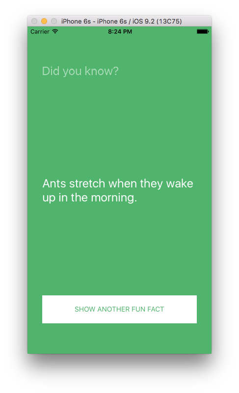

A [React Native](https://facebook.github.io/react-native/) implementation of the FunFacts app built in the [Treehouse](https://teamtreehouse.com/) courses:
- [Build a Simple Android App](https://teamtreehouse.com/library/build-a-simple-android-app-2)
- [Build a Simple iPhone App with Swift 2.0](https://teamtreehouse.com/library/build-a-simple-iphone-app-with-swift-20)
- [Build a Simple iPhone App With Objective-C](https://teamtreehouse.com/library/build-a-simple-iphone-app-with-objectivec)

To run the application make sure node.js and React Native are [setup](https://facebook.github.io/react-native/docs/getting-started.html#content) properly.

In your terminal:

```
$ cd ~/Desktop
$ git clone https://github.com/griffinsockwell/FunFacts.git
$ cd FunFacts
$ npm install
$ npm start
```

Open the ios/FunFacts.xcodeproj in Xcode and click play.

To run on Android find it in the docs [here](https://facebook.github.io/react-native/docs/android-setup.html#content).

To run on an iOS device find it in the docs [here](https://facebook.github.io/react-native/docs/running-on-device-ios.html#content).

To run on an Android device find it in the docs [here](https://facebook.github.io/react-native/docs/running-on-device-android.html#content).


